# KNX-NG-Monitor

A modern, self-contained KNX bus monitoring tool with a web interface that displays, historizes, and presents KNX telegrams in real-time. Ships as a Docker image or as a single self-contained binary for Linux, Windows and macOS (x64 + arm64).

[](https://github.com/ingel81/knx-ng-monitor/releases)
[](https://hub.docker.com/r/ingel81/knx-ng-monitor)
[](./LICENSE)

> **Beta** - this is an actively developed beta. It is stable enough for daily
> monitoring, but expect rough edges. If you run KNX, please give it a spin and
> [open an issue](https://github.com/ingel81/knx-ng-monitor/issues) with bugs,
> ideas or wishes - feedback from the KNX / smart-home community is exactly what
> shapes the next releases. See [Beta & feedback](#beta--feedback) below.

<!-- SCREENSHOTS:START -->
## Screenshots

<div align="center">

<a href="docs/screenshots/hero.webm">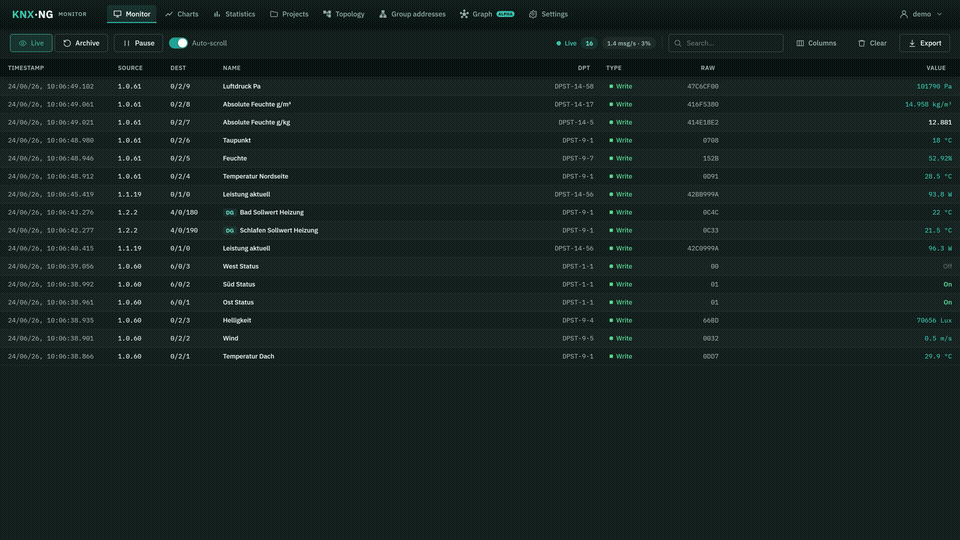</a>

</div>

### Video tour

A ~4-minute guided walkthrough of every feature. The app UI itself is bilingual (DE / EN, switchable live); the voice-over comes in two versions:

**🇬🇧 English**

https://github.com/user-attachments/assets/d42fe0cb-d088-48fa-a07a-ead21aeebbbe

**🇩🇪 Deutsch**

https://github.com/user-attachments/assets/3b4ca0b0-97f8-420f-acb7-784465a6f5a5

<sub>Click any thumbnail for the full-resolution image.</sub>

### Desktop

<table>
  <tr>
    <td align="center" width="50%">
      <a href="docs/screenshots/login.webp">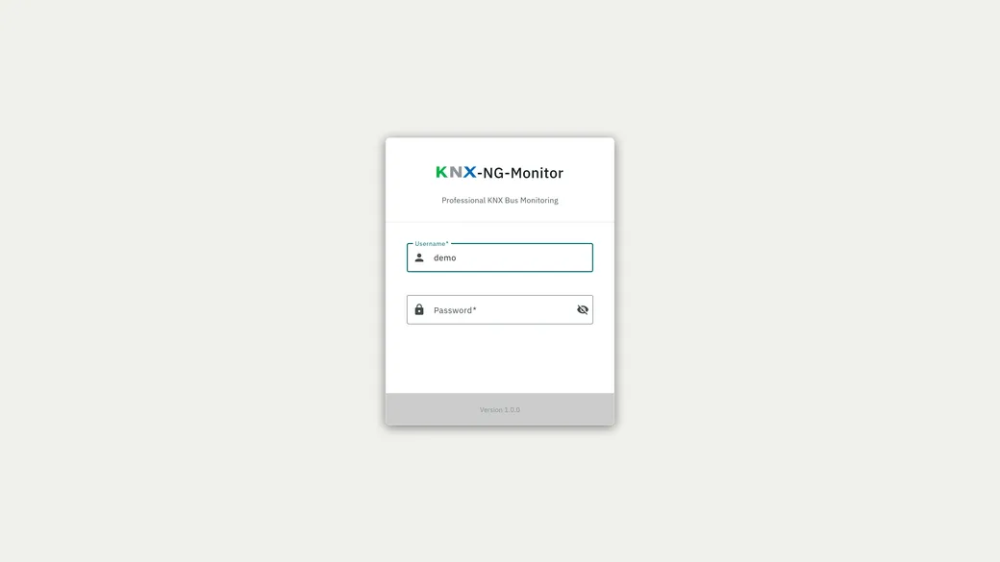</a><br>
      <sub><b>Login</b><br>JWT auth, dark/light aware</sub>
    </td>
    <td align="center" width="50%">
      <a href="docs/screenshots/monitor-live.webp">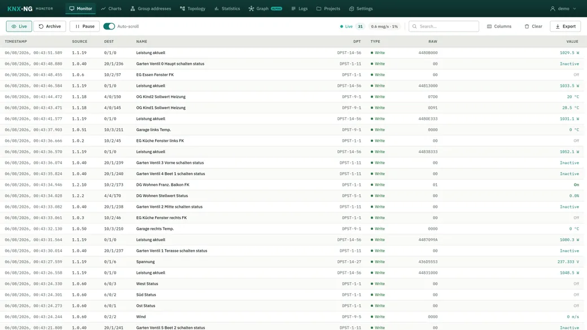</a><br>
      <sub><b>Monitor - Live</b><br>Real-time KNX telegrams off the bus</sub>
    </td>
  </tr>
  <tr>
    <td align="center" width="50%">
      <a href="docs/screenshots/monitor-detail.webp">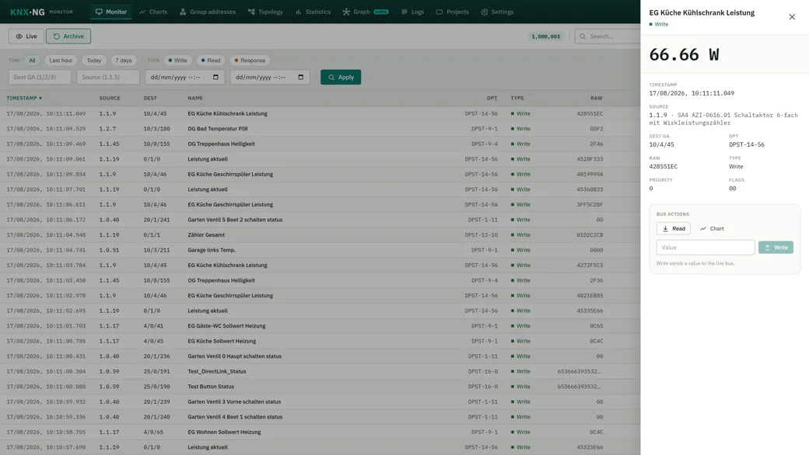</a><br>
      <sub><b>Telegram detail</b><br>Value, bus actions, used-by, chart jump</sub>
    </td>
    <td align="center" width="50%">
      <a href="docs/screenshots/monitor-archive.webp">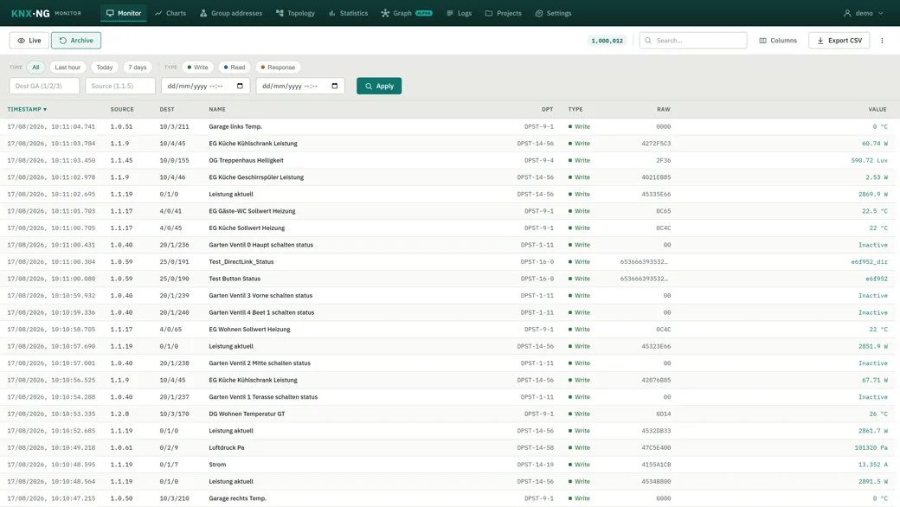</a><br>
      <sub><b>Monitor - Archive</b><br>Historized traffic, structured filters</sub>
    </td>
  </tr>
  <tr>
    <td align="center" width="50%">
      <a href="docs/screenshots/charts.webp">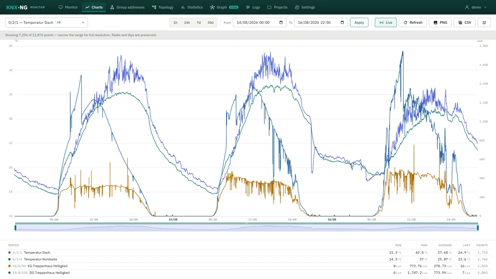</a><br>
      <sub><b>Charts - power</b><br>Live value trends per group address</sub>
    </td>
    <td align="center" width="50%">
      <a href="docs/screenshots/charts-temp.webp">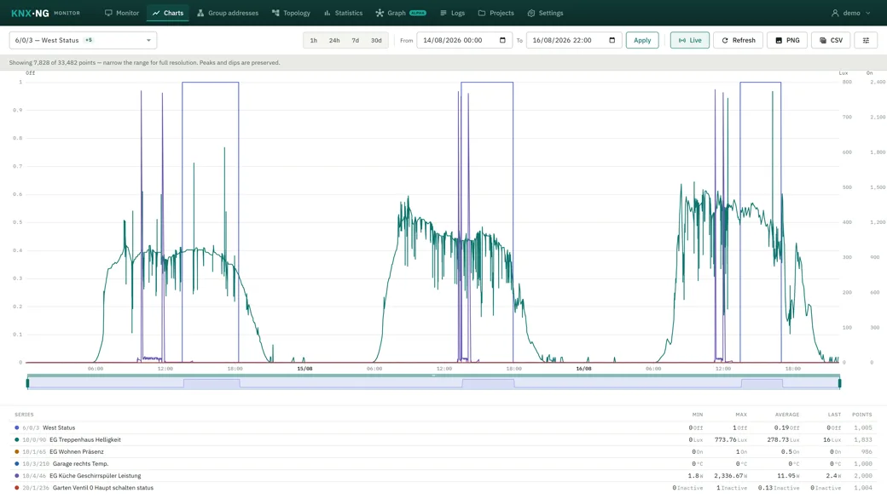</a><br>
      <sub><b>Charts - temperature</b><br>Sensor curve over time</sub>
    </td>
  </tr>
  <tr>
    <td align="center" width="50%">
      <a href="docs/screenshots/stats.webp"></a><br>
      <sub><b>Statistics</b><br>Totals, msg/s, telegrams over time</sub>
    </td>
    <td align="center" width="50%">
      <a href="docs/screenshots/stats-heatmap.webp">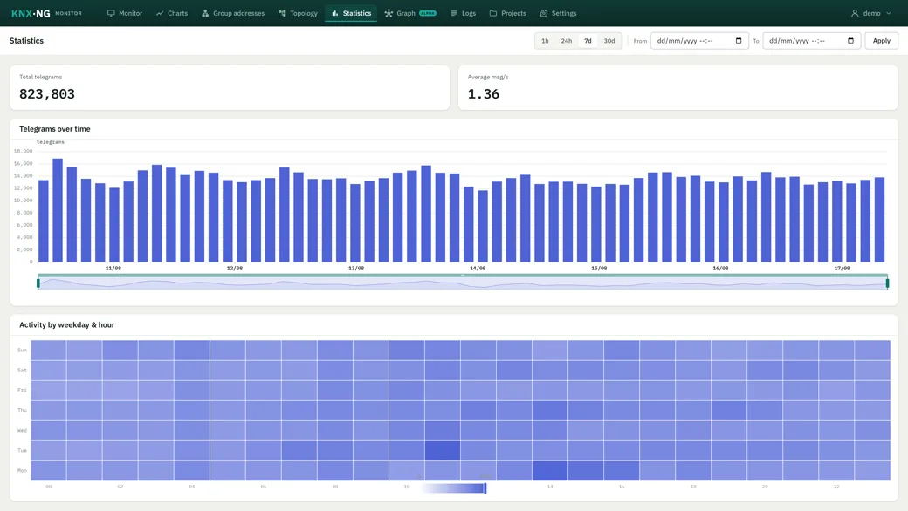</a><br>
      <sub><b>Activity heatmap</b><br>Telegrams by weekday × hour</sub>
    </td>
  </tr>
  <tr>
    <td align="center" width="50%">
      <a href="docs/screenshots/topology.webp">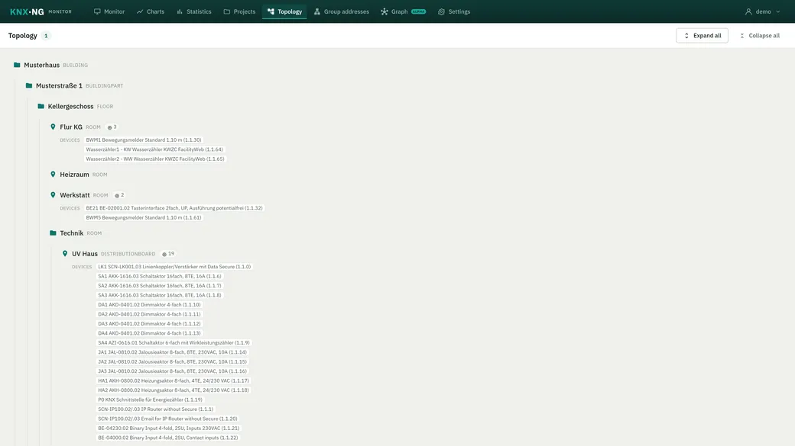</a><br>
      <sub><b>Topology</b><br>Building tree with devices</sub>
    </td>
    <td align="center" width="50%">
      <a href="docs/screenshots/group-addresses.webp">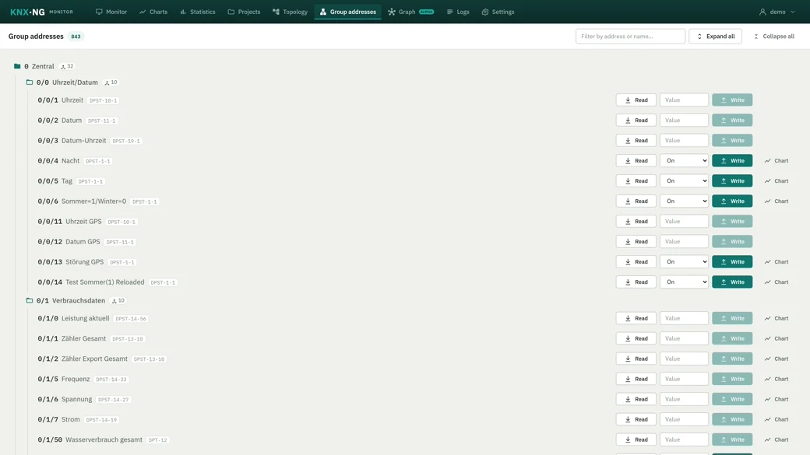</a><br>
      <sub><b>Group addresses</b><br>3-level tree, read / write / chart</sub>
    </td>
  </tr>
  <tr>
    <td align="center" width="50%">
      <a href="docs/screenshots/projects.webp">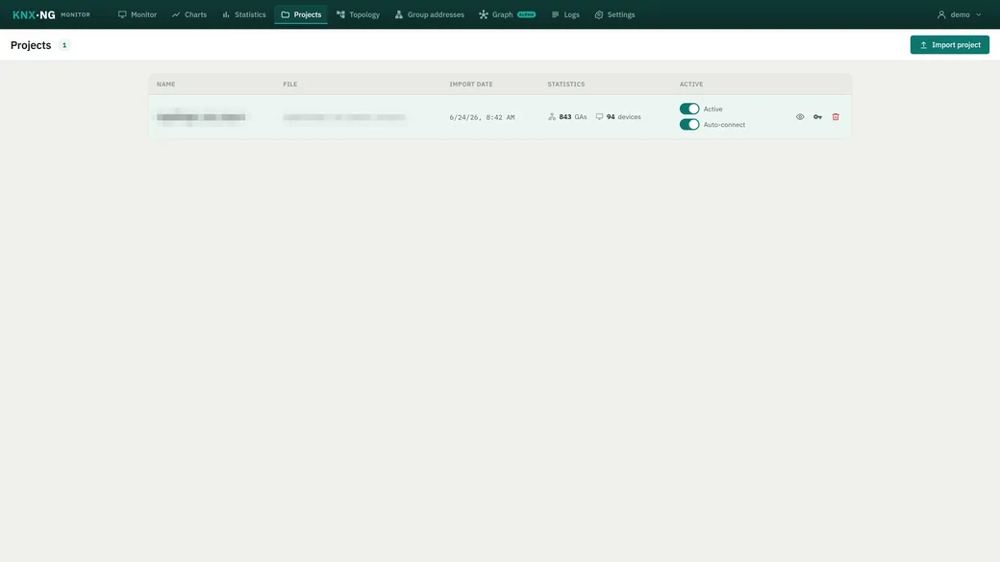</a><br>
      <sub><b>Projects</b><br>ETS import, active project, auto-connect</sub>
    </td>
    <td align="center" width="50%">
      <a href="docs/screenshots/settings.webp">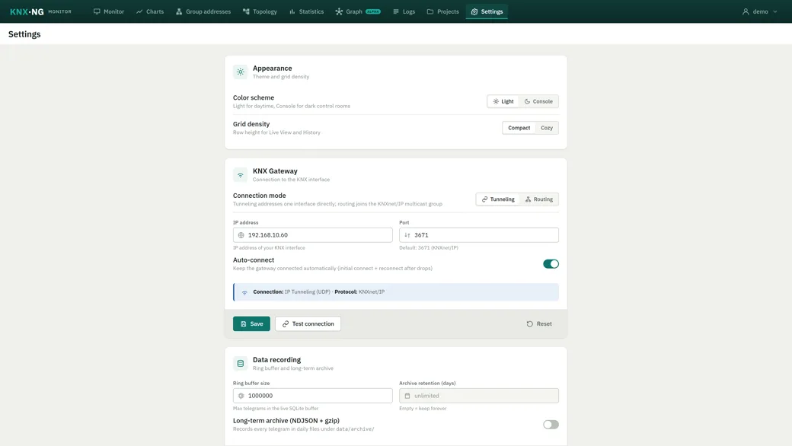</a><br>
      <sub><b>Settings</b><br>KNX interface, recording, theme & density</sub>
    </td>
  </tr>
  <tr>
    <td align="center" width="50%">
      <a href="docs/screenshots/graph.webp">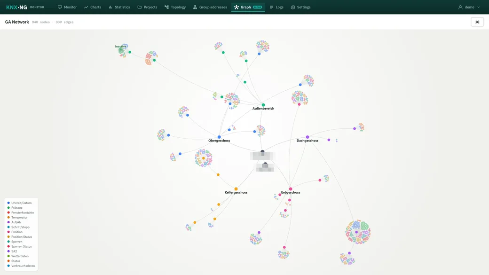</a><br>
      <sub><b>GA network - Alpha</b><br>Force-directed building map, live activity</sub>
    </td>
    <td align="center" width="50%">
      <a href="docs/screenshots/projects-import.webp">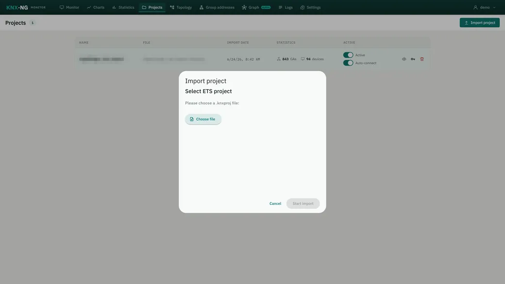</a><br>
      <sub><b>Import wizard</b><br>Two-stage ETS import with password / keyring</sub>
    </td>
  </tr>
  <tr>
    <td align="center" width="50%">
      <a href="docs/screenshots/projects-detail.webp">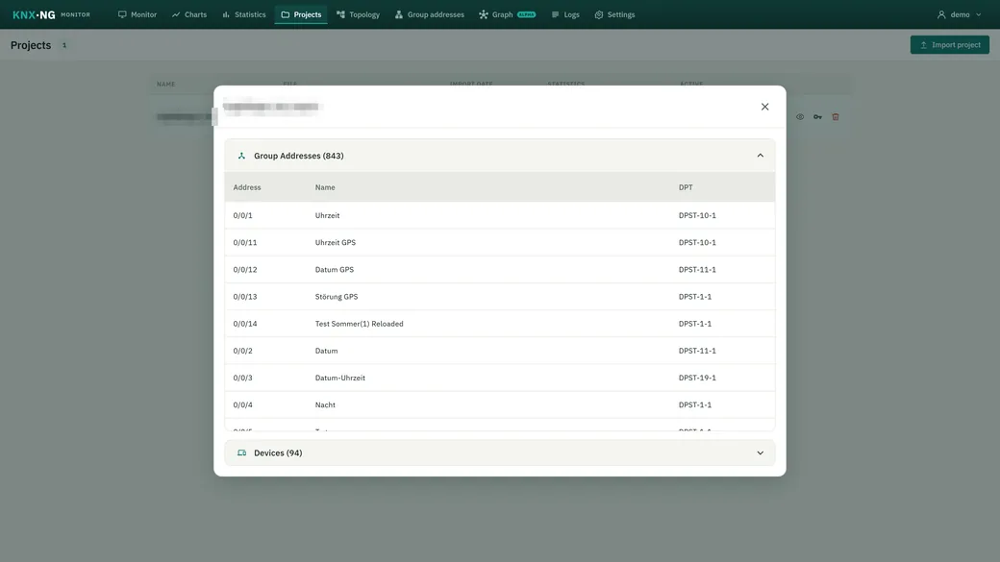</a><br>
      <sub><b>Project detail</b><br>Group addresses & devices</sub>
    </td>
    <td align="center" width="50%">
      <a href="docs/screenshots/logs.webp">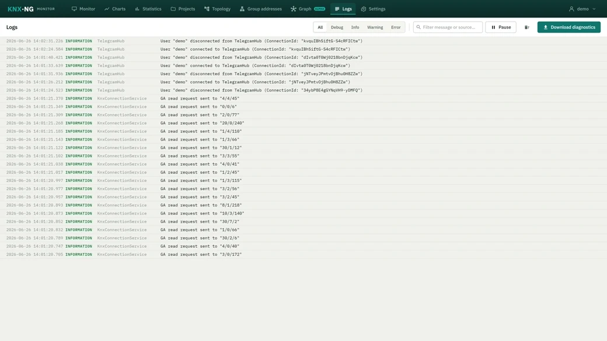</a><br>
      <sub><b>Log viewer</b><br>Live, filterable & searchable · diagnostics download</sub>
    </td>
  </tr>
</table>

### Mobile

<table>
  <tr>
    <td align="center">
      <a href="docs/screenshots/monitor-live-mobile.webp">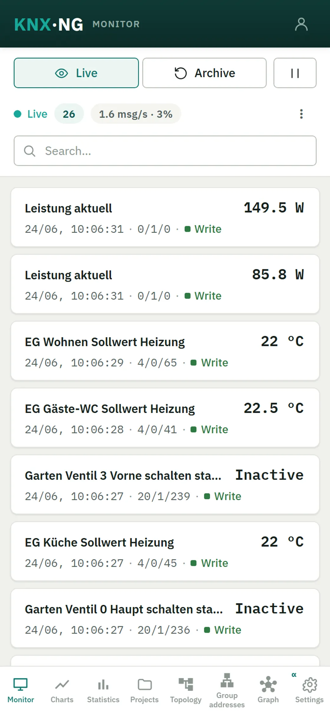</a><br>
      <sub><b>Monitor - Live</b></sub>
    </td>
    <td align="center">
      <a href="docs/screenshots/charts-mobile.webp">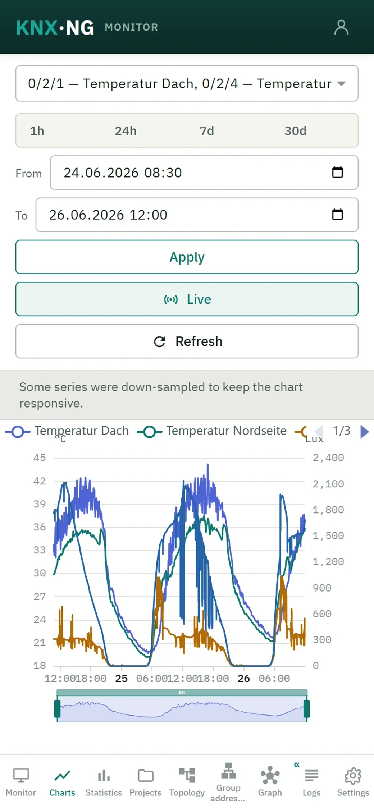</a><br>
      <sub><b>Charts - power</b></sub>
    </td>
    <td align="center">
      <a href="docs/screenshots/stats-mobile.webp">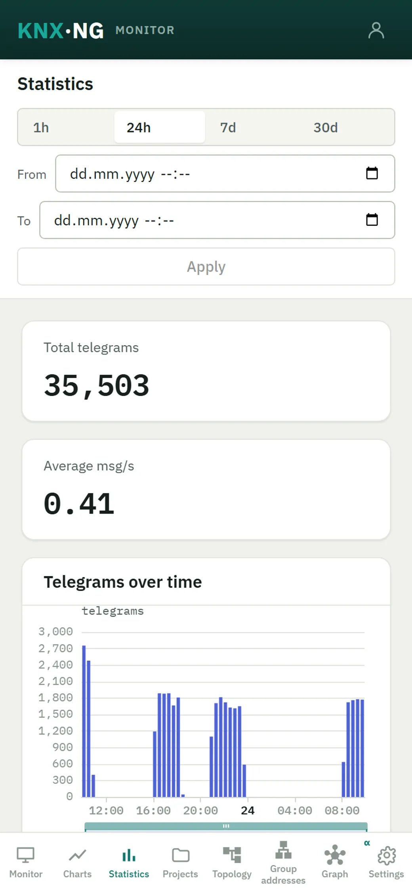</a><br>
      <sub><b>Statistics</b></sub>
    </td>
  </tr>
</table>

<!-- SCREENSHOTS:END -->

## Features

- **Real-time KNX monitoring** - live view of bus telegrams via SignalR, **always-on**: auto-connects on startup and reconnects after gateway/network/container interruptions
- **DPT decoding** - via the Falcon datapoint catalog: full DPT range, sub-type aware, with units and enumeration names (English labels, locale-invariant numbers)
- **ETS project import** - ETS 4 / 5 / 6 `.knxproj` files, three- / two-level / free addressing
- **KNX Secure** - password-protected projects (incl. ETS6 PBKDF2/AES wrapping) and `.knxkeys` keyring decryption; **Data Secure** group telegrams decrypted at runtime, optional opt-in IP-Secure tunnel
- **Unified Monitor view** - one view with a **Live / Archive** toggle and a shared filter; custom virtual-scroll grid with color-coding (Read / Write / Response), value semantics + DPST units, live bus-load badge (msg/s + %), pause (no telegram loss), auto-scroll, free-text + room filter
- **Charts & statistics** - time-series charts for numeric DPTs (separate Y-axes per unit, live append), a statistics view (total, average msg/s, telegrams over time) and a weekday × hour activity heatmap
- **Topology & group-address tree** - Locations (building → floor → room) and com-objects parsed across ETS 4/5/6, a Topology tree view, a 3-level group-address tree, a room filter and a "used by" device list; plus a force-directed **GA network graph (Alpha)**
- **Write / read from the UI** - send a GroupValueRead or write a DPT-typed value to the live bus from the detail drawer, behind a confirmation dialog
- **Data recording** - two-tier, fully self-contained: count-based SQLite hot-tier ring buffer (bounded size) plus an opt-in NDJSON+gzip long-term archive; keyset-paginated query API and server-streamed CSV export
- **Runtime DE / EN** - full bilingual UI, switchable without a reload
- **JWT auth** - access tokens (15 min) + refresh tokens (7 days), secret auto-generated on first start
- **Single-port deployment** - backend serves the Angular frontend in production

## Platform coverage

Prebuilt **self-contained binaries** (no .NET install required) are published for
every release:

| OS | Architectures |
|---|---|
| Linux | `linux-x64`, `linux-arm64` (Raspberry Pi, 64-bit) |
| Windows | `win-x64`, `win-arm64` |
| macOS | `osx-x64`, `osx-arm64` (Apple Silicon) |

The **Docker image** is multi-arch (`amd64` + `arm64`).

> **64-bit OS required.** There is no 32-bit ARM build (so 32-bit Raspberry Pi
> OS is not supported - use the 64-bit image) and no Alpine/musl build (the
> binaries are glibc-based; the Docker image is `debian:12-slim`).

## Quick Start

### Docker (recommended)

```bash
docker run -d \
  -p 8080:8080 \
  -v ./data:/app/data \
  --name knx-monitor \
  ingel81/knx-ng-monitor:latest
# UI: http://localhost:8080
```

`docker-compose.yml`:

```yaml
services:
  knx-monitor:
    image: ingel81/knx-ng-monitor:latest
    container_name: knx-monitor
    restart: unless-stopped
    ports: ["8080:8080"]
    volumes: ["./data:/app/data"]
```

### Self-contained binary (no .NET required)

Download the archive for your platform from
[Releases](https://github.com/ingel81/knx-ng-monitor/releases):

```bash
# Linux / macOS (pick the matching -x64 / -arm64 archive)
wget https://github.com/ingel81/knx-ng-monitor/releases/latest/download/knx-ng-monitor-linux-x64.tar.gz
tar -xzf knx-ng-monitor-linux-x64.tar.gz
./KnxMonitor.Api          # http://localhost:8080
```

Windows: download `knx-ng-monitor-win-x64.zip` (or `-win-arm64.zip`), extract,
run `KnxMonitor.Api.exe`.

### First-time setup

1. Open `http://localhost:8080`
2. The initial-setup wizard creates the admin user
3. (optional) Import a `.knxproj` - see [ETS project import](#ets-project-import) below
4. Configure the KNX IP interface in **Settings** (IP, port, tunneling/routing)
5. Open the **Monitor** view and start watching the bus

## ETS project import

Importing your ETS project enriches every telegram with group-address names, DPT
types and room/building context. The two-stage wizard walks through:

1. **File selection** - pick the `.knxproj`
2. **Analyzing** - a fast pre-scan determines ETS version, password protection and addressing style
3. **Project password** - prompted if the inner archive is encrypted (ETS 4 / 5 / 6)
4. **Re-detect after unlock** - once the password is in, the server decrypts and re-scans for KNX Secure indicators
5. **Keyring (optional)** - if KNX Secure is detected, the wizard offers a `.knxkeys` upload + keyring password. Skip is always possible - tool keys / backbone key are only needed for runtime telegram **decoding**, not for parsing. You can also upload a keyring later, per project, without re-importing
6. **Import** - group addresses, devices, locations and communication objects
7. **Auto-activate** - if no other project is active yet, the new project is activated immediately

## Configuration

### Environment variables

| Variable | Default | Purpose |
|---|---|---|
| `ASPNETCORE_ENVIRONMENT` | `Production` | `Development` enables CORS for `:4200`, the separate dev server and the scalar/v1 API docs |
| `ASPNETCORE_URLS` | `http://+:8080` | Listen URL - change to use a different port |
| `KNX_LOG_LEVEL` | `Information` | Log verbosity: `Verbose`, `Debug`, `Information`, `Warning`, `Error`, `Fatal` (see [Logging & diagnostics](#logging--diagnostics)) |

### Data directory

Everything stateful lives under `./data/`:

- `.jwt-secret` - the JWT signing key, auto-generated on first start (file mode 600 on Unix). **Do not delete it** or all sessions become invalid; never commit it.
- `knxmonitor.db` (+ `-wal` / `-shm`) - the SQLite database
- `archive/` - optional NDJSON+gzip long-term telegram archive
- `logs/` - rolling log files (see below)

With Docker this is the mounted `/app/data` volume. The self-contained binary
writes `./data` next to the executable (not the current working directory), so
the same database is used regardless of where you launch it from.

### KNX connection

Configured on the **Settings** page in the UI:

- IP address of the KNX IP-Interface or router
- Port (default 3671 for KNXnet/IP)
- Connection type: Tunneling or Routing
- Optional physical address

## Troubleshooting & logs

If something misbehaves, there are three ways to see what's going on - and one
button that packages it all up for a bug report.

- **In-app Logs viewer** - a **Logs** page in the UI streams the backend log live
  (filter by level, free-text search). Quickest way to spot a connection or
  import error without leaving the browser.
- **Log files on disk** - full rolling logs are written to `./data/logs/`
  (`knxmonitor-YYYYMMDD.log`). With Docker they live on your mounted `./data`
  volume, so they survive container restarts and can be read from the host.
- **Download diagnostics** - a **Download diagnostics** button produces a single
  `.zip` containing the recent logs and a `system-info.json` (version, OS,
  architecture, runtime, configured log level, DB size). Attach it to a
  [GitHub issue](https://github.com/ingel81/knx-ng-monitor/issues) so the bug can
  be reproduced quickly.

### Logging & diagnostics

Log verbosity is controlled by the `KNX_LOG_LEVEL` environment variable:

| Value | Use |
|---|---|
| `Verbose` | Everything, very chatty - deep debugging only |
| `Debug` | Detailed flow, handy when filing a bug |
| `Information` | **Default** - normal operational messages |
| `Warning` | Only warnings and above |
| `Error` | Only errors and above |
| `Fatal` | Only fatal, process-ending failures |

Logs roll **daily** into `./data/logs/` and are **retained for 14 days** (also
capped at 50 MB per file). To capture more detail for a report, start the app
with e.g. `KNX_LOG_LEVEL=Debug`, reproduce the issue, then use **Download
diagnostics**.

```bash
# Docker example with verbose logging
docker run -d -p 8080:8080 -v ./data:/app/data \
  -e KNX_LOG_LEVEL=Debug \
  --name knx-monitor ingel81/knx-ng-monitor:latest
```

## Beta & feedback

KNX-NG-Monitor is a beta and it improves fastest with real installations behind
it. If you run KNX at home or at work:

- **Try it** against your own bus and ETS project.
- **Report bugs and ideas** on [GitHub issues](https://github.com/ingel81/knx-ng-monitor/issues) - include a [diagnostics zip](#troubleshooting--logs) where relevant.
- **Spread the word** in your KNX / smart-home forum or community; more eyes mean better coverage of real-world devices and DPTs.

Thanks for testing!

## Project status

**Current - v0.8.0:** in-app Logs viewer (live log stream), one-click diagnostics
zip, rolling file logs (`KNX_LOG_LEVEL`), history-preserving re-import (keeps
telegram history), data dir anchored to the executable, hardened refresh-token
auth, and multi-arch (amd64 + arm64) Docker images. Builds on v0.7.0: GA network
graph (Alpha), weekday × hour activity heatmap, mobile-responsive overhaul,
account menu. Earlier: unified Monitor (Live/Archive), time-series charts +
statistics, building topology, group-address tree, runtime DE/EN switch, GA
write/read, KNX Secure runtime decryption + optional IP-Secure tunnel.

**Next:** topology/room live dashboard with current values, runtime Secure
on-hardware acceptance, notifications (mail/webhook/MQTT), device detail view.

Full version history: [CHANGELOG.md](CHANGELOG.md) ·
[GitHub Releases](https://github.com/ingel81/knx-ng-monitor/releases).

## Documentation

- **[CHANGELOG.md](CHANGELOG.md)** - full version history
- **[DEVELOPMENT.md](DEVELOPMENT.md)** - build from source, tests, CLI parser tool, EF migrations, architecture, API, contributing & release process
- **[THIRD-PARTY-NOTICES.md](THIRD-PARTY-NOTICES.md)** - bundled third-party components and their licenses

## License

This project's own source code is licensed under the **MIT** license - see
[`LICENSE`](./LICENSE).

It bundles third-party components that remain under their own licenses - most
notably the **KNX Falcon SDK**, which is **proprietary** (KNX Tools Software
License Agreement, free of fees, redistribution to end-users permitted). The MIT
license does **not** cover the Falcon SDK. See
[`THIRD-PARTY-NOTICES.md`](THIRD-PARTY-NOTICES.md) for the full list and terms.

> "KNX" is a registered trademark of the KNX Association. This project is an
> independent tool, not affiliated with or endorsed by the KNX Association.

## Author

ingel81.
